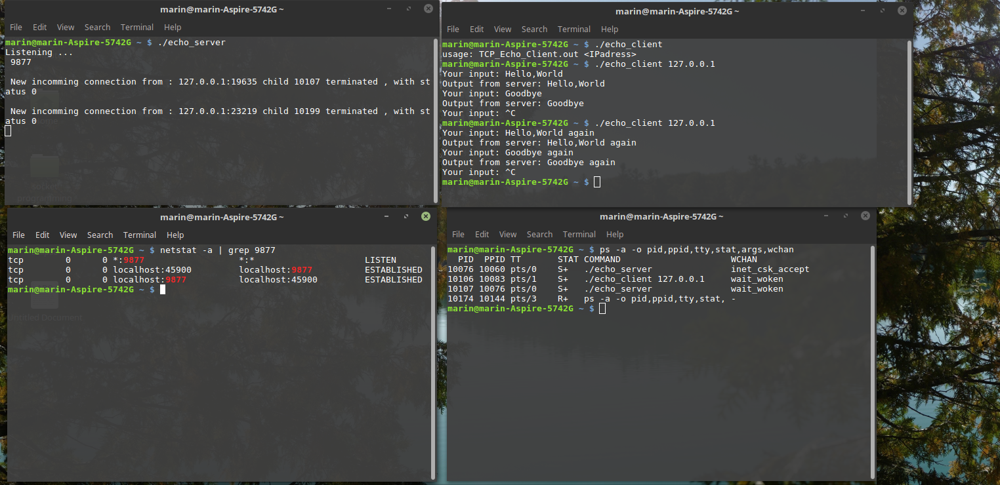
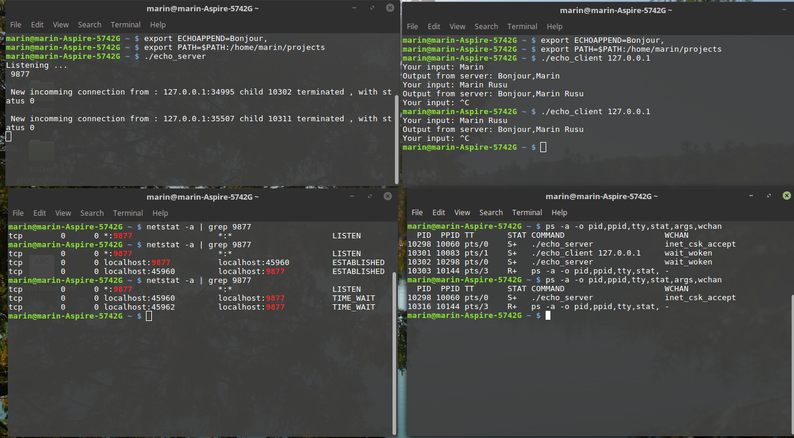

# TCP-Echo-Client-Server
Client/Server realisation of Unix echo server
Parralel Server , each client is treated by a child process

Output from server can be configured by a environement variable

